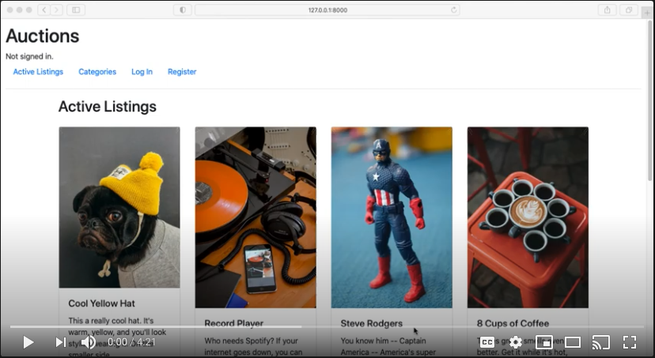

# Commerce

CS50W Project 2: Design an eBay-like e-commerce auction site that will allow users to post auction listings, place bids on listings, comment on those listings, and add listings to a watchlist.

Built with Python, Django, and Bootstrap 4 

# Demo

